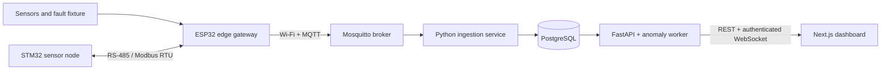

# Intelligent Industrial IoT Monitoring Platform

> Implementation status: source-complete pre-release demonstrator. Software and
> synthetic evidence are `SIMULATED`; no bench or field verification is claimed.
> Native embedded builds, CAD release checks, post-fix browser evidence, CI on
> GitHub, and publication remain explicit release gates.

A retrofit condition-monitoring demonstrator for a small workshop motor, pump,
or ventilation fan. The system is designed for equipment that is currently
checked manually and where a full SCADA or predictive-maintenance suite would
be disproportionate. It combines temperature, vibration, and DC current
telemetry with offline buffering, Modbus RTU interoperability, deterministic
alarms, and an explainable Isolation Forest comparison.

The reference asset is `motor-01` at site `workshop-demo`. Seeded and simulated
measurements are always labeled as synthetic.

## Architecture



## Safety boundary

This is a portfolio-grade engineering demonstrator, not a certified safety
controller. Its relay output is limited to a low-voltage demonstration load.
It must not switch mains power or implement an emergency stop, personnel
protection, or unattended safety-critical shutdown. The bench procedure
requires a physical method to remove actuator power.

## Local software demo

Start the local software stack with:

```sh
cp .env.example .env
make demo
make scenario-normal
```

This starts PostgreSQL, Mosquitto, FastAPI, MQTT ingestion, a simulated gateway,
the anomaly worker, and the responsive operator dashboard at
`http://localhost:3000`. The simulated gateway publishes retained health and
safe-state command acknowledgements. ESP32 and STM32 targets, editable Wokwi
projects, Modbus PTY simulation, and the versioned per-device anomaly workflow
are implemented. Python anomaly/Modbus paths pass source and integration tests;
the embedded targets are not compiled in the available environment. The
hardware review package is editable and statically checked but intentionally
un-routed and not released for fabrication because KiCad/FreeCAD execution and
physical evidence are unavailable. Exact evidence and known limits are recorded
in the [verification report](docs/verification-report.md).

Run the local software gates with:

```sh
python -m venv .venv
.venv/bin/pip install -r requirements/ci.lock
npm --prefix web ci
make check
```

The full Compose/API smoke is `make compose-smoke` while the stack is running.
GitHub CI additionally starts a clean stack and runs the desktop/mobile
Playwright happy path.

## Engineering reports

- [English engineering report](docs/report/Intelligent_Industrial_IoT_Monitoring_Platform_EN.pdf)
- [گزارش مهندسی فارسی](docs/report/Intelligent_Industrial_IoT_Monitoring_Platform_FA.pdf)

Both PDFs are generated from editable Markdown sources, use an invariant PDF
build, and pass font/text/page rendering checks plus contact-sheet inspection.
The separate hardware connectivity PDF is marked review-only and is not a
KiCad schematic export or fabrication release.

## Repository map

| Path | Responsibility |
| --- | --- |
| `contracts/` | Versioned MQTT schemas, examples, and topic policy |
| `services/` | FastAPI, MQTT ingestion, and anomaly processes |
| `web/` | Responsive Next.js operator dashboard |
| `firmware/` | ESP32 gateway, STM32 node, shared logic, and host tests |
| `simulator/` | Telemetry, Modbus, Wokwi, and named fault scenarios |
| `hardware/` | KiCad, BOM, fabrication, model provenance, and enclosure |
| `docs/` | Architecture, operation, verification, traceability, and reports |

The dashboard workflows and security boundary are documented in
[`docs/dashboard.md`](docs/dashboard.md).

The repository does not currently include a dashboard screenshot. A previous
browser smoke was observed, but the environment did not permit a new capture
after the live-channel fix; substituting a fabricated or stale image would be
misleading. The committed Playwright flow and GitHub Compose job are the release
path for producing that evidence.

## Verification levels

- `SIMULATED`: demonstrated with host software, test fixtures, or Wokwi.
- `BENCH-VERIFIED`: executed on the documented low-voltage physical bench.
- `FIELD-VALIDATED`: evaluated on real equipment under a controlled protocol.

The current software ingestion and authenticated operations slices are
`SIMULATED`. The ESP32 path is implemented but build-blocked, not verified.
Hardware paths remain explicitly unverified unless physical evidence is
supplied.

## Known limitations and roadmap

The immediate priorities are (1) run ESP-IDF and STM32Cube target builds with
size evidence, (2) migrate and route the board in KiCad 10 and pass native
ERC/DRC before regenerating real fabrication outputs, and (3) run the complete
GitHub CI/Compose/browser flow and capture a truthful dashboard image. The
phased plan and exit criteria are in
[roadmap and limitations](docs/roadmap-and-limitations.md).

## Author and license

Copyright (c) 2026 Amin Zoroufi <aminn.zoroufi@gmail.com>

Source is visible for portfolio inspection under the custom
[Portfolio Source-Available License](LICENSE.md). This is not an open-source
license and it is marked for legal review.

Locked runtime dependency attribution is recorded in the
[dependency/license inventory](docs/dependency-license-inventory.csv).
