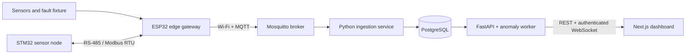

# Intelligent Industrial IoT Monitoring Platform

> Implementation status: active development. No bench or field verification is
> claimed. Evidence will be recorded in `docs/verification-report.md` as each
> vertical slice is executed.

A retrofit condition-monitoring demonstrator for a small workshop motor, pump,
or ventilation fan. The system is designed for equipment that is currently
checked manually and where a full SCADA or predictive-maintenance suite would
be disproportionate. It combines temperature, vibration, and DC current
telemetry with offline buffering, Modbus RTU interoperability, deterministic
alarms, and an explainable Isolation Forest comparison.

The reference asset is `motor-01` at site `workshop-demo`. Seeded and simulated
measurements are always labeled as synthetic.

## Architecture



## Safety boundary

This is a portfolio-grade engineering demonstrator, not a certified safety
controller. Its relay output is limited to a low-voltage demonstration load.
It must not switch mains power or implement an emergency stop, personnel
protection, or unattended safety-critical shutdown. The bench procedure
requires a physical method to remove actuator power.

## Local software demo

Start the verified backend operations slice with:

```sh
cp .env.example .env
make demo
make scenario-normal
```

This starts PostgreSQL, Mosquitto, FastAPI, MQTT ingestion, and a simulated
gateway with retained health and safe-state command acknowledgements. The
dashboard, embedded firmware, anomaly worker, and hardware paths remain pending.
Exact executed evidence is recorded in `docs/verification-report.md`.

## Repository map

| Path | Responsibility |
| --- | --- |
| `contracts/` | Versioned MQTT schemas, examples, and topic policy |
| `services/` | FastAPI, MQTT ingestion, and anomaly processes |
| `web/` | Responsive Next.js operator dashboard |
| `firmware/` | ESP32 gateway, STM32 node, shared logic, and host tests |
| `simulator/` | Telemetry, Modbus, Wokwi, and named fault scenarios |
| `hardware/` | KiCad, BOM, fabrication, model provenance, and enclosure |
| `docs/` | Architecture, operation, verification, traceability, and reports |

## Verification levels

- `SIMULATED`: demonstrated with host software, test fixtures, or Wokwi.
- `BENCH-VERIFIED`: executed on the documented low-voltage physical bench.
- `FIELD-VALIDATED`: evaluated on real equipment under a controlled protocol.

The current software ingestion and authenticated operations slices are
`SIMULATED`. Hardware paths remain explicitly unverified unless physical
evidence is supplied.

## Author and license

Copyright (c) 2026 Amin Zoroufi <aminn.zoroufi@gmail.com>

Source is visible for portfolio inspection under the custom
[Portfolio Source-Available License](LICENSE.md). This is not an open-source
license and it is marked for legal review.
