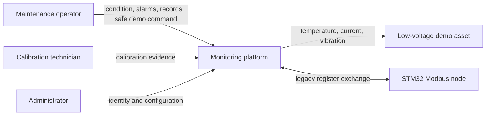
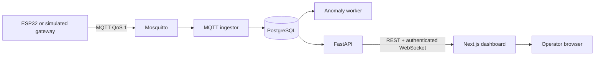
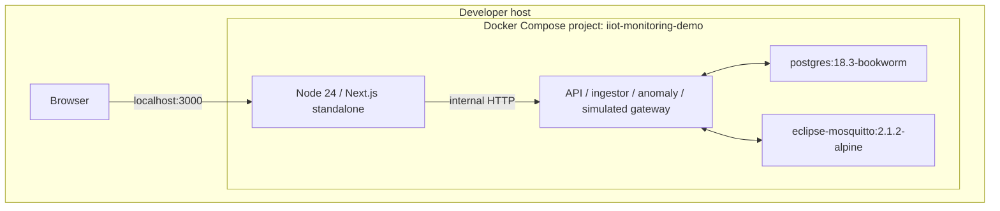
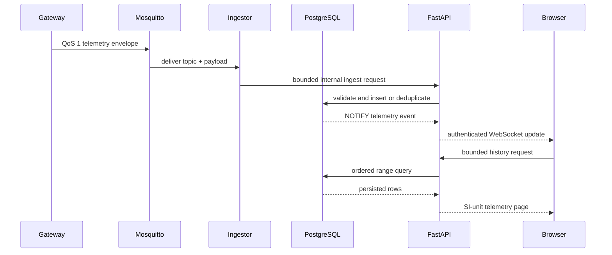

# System overview

## Problem and users

Workshop maintainers often inspect small motors, pumps, and fans manually. A
bearing problem, overload, blocked cooling path, or failed sensor can emerge
between inspections. The demonstrator provides maintainers with continuous
condition signals without pretending to replace a certified safety system.

Primary stakeholders are a maintenance operator, a calibration technician, a
system administrator, and an engineer evaluating retrofit feasibility.

## Scope

- one ESP32 gateway for temperature, vibration, DC current, local thresholds,
  bounded buffering, MQTT, and a low-voltage demo actuator;
- one focused STM32 sensor node exposing a versioned Modbus RTU register map;
- separate ingestion, API, and anomaly processes backed by PostgreSQL;
- an authenticated browser UI for live condition, alarms, calibration,
  maintenance, export, and detector comparison;
- deterministic host simulation and named fault scenarios.

## Non-goals

- certified protection, emergency stop, or direct mains switching;
- diagnosis of a specific mechanical root cause from synthetic data;
- high-availability cloud operations or multi-tenant billing;
- claiming simulated performance as field performance.

## Success criteria

Success means the seeded MQTT-to-dashboard path is reproducible from a clean
clone; replay is idempotent; alarm and command actions are authenticated and
audited; firmware calculations and Modbus frames are host-tested; anomaly
results are reproducible and explained by observed features; and all remaining
hardware gaps are visible in the verification report.

## System context



## Container view



## Local deployment



Exact tags are selected for reproducibility but are not yet digest-pinned. The
Compose network uses public development credentials and plain MQTT only inside
the local demonstrator boundary.

## Telemetry and live-update sequence



## Safe relay-command sequence

```mermaid
sequenceDiagram
  participant O as Operator
  participant A as FastAPI
  participant P as PostgreSQL
  participant M as Mosquitto
  participant G as Gateway
  O->>A: authenticated relay request + timeout
  A->>P: audit accepted command
  A->>M: publish device-scoped command
  M->>G: QoS 1 command
  G->>G: validate ID, target, expiry, safe policy
  G->>M: acknowledgement with resulting state
  M->>A: command acknowledgement
  A->>P: durable completion/rejection audit
  A-->>O: live status; relay auto-clears OFF
```
